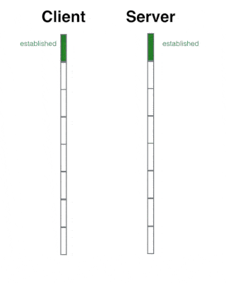

innodb引擎

###### Read commited和Repeatable Read的区别

1. Repeatable Read为默认隔离级别
2. 均使用了**非锁定的一致性读**

> 一致性的非锁定读（consistent nonlocking read）是指InnoDB存储引擎通过行多版本控制（multi versioning）的方式来读取当前执行时间数据库中行的数据。如果读取的行正在执行DELETE或UPDATE操作，这时读取操作不会因此去等待行上锁的释放。相反地，InnoDB存储引擎会去读取行的一个快照数据。

3. Read Commited读最新的历史版本，而Repeatable Read读事务开始时的历史版本。如下图，二者结果不同：

   (普通select均时非锁定读，但MVCC使用的快照版本不同)
   

   Read Commited读的结果为1,1,0；Repeatable Read读的结果为1,1,1。

4. Repeatable Read使用Next-Key Lock（Record Lock + gap Lock）算法来解决了**幻读**的问题，因此，已经满足了ACID中隔离性要求，不需要SERIALIZABLE级别。

   参考链接https://www.jianshu.com/p/04a2a6580bff
   
###### 优化器选择不使用索引的情况

1. 辅助索引查询数据较多时（通常为range，join，超过20%），选选择直接查聚集索引，避免查书签离散读(查主键索引)，所以直接查主键索引；
2. 存在联合索引的情况下，在排序读的情况下，直接查联合索引，因为已经排序过了。
   
  
   
###### 页面置换算法

背景：在非连续内存分配的基础上，把一部分内容放到外存   ----> 虚拟存储

虚拟页式存储，页表项中相关的字段有：

1. 驻留位：表示该页是否在内存
2. 修改位：表示在内存中的该页是否被修改过（如果被修改过，则在置换出该页时，需要将该页写回到外存）
3. 访问位：表示该页面是否被访问过（用于页面置换算法）
4. 保护位：只读、只写等。
5. 锁定位：页面不允许被置换。

缺页：虚拟页式存储中发生的。

CPU找页表中，改页表项的驻留位为0或未找到改页表项，则发出缺页中断，由缺页服务例程处理--->在外存中找到改页（**如何找？**），并将该页**换入内存**（如果没有空闲页面，则使用页面置换算法），并修改页表项。

1. 如何找？

   https://blog.csdn.net/m0_37962600/article/details/81448553

   do_pg_fault.c  --> 最终ireturn，重新执行出错的指令

   虚拟页和磁盘扇区的对应关系？swap_entry.c。页面项**prevent**位表示当前映射关系时 逻辑地址--->页号或者 逻辑地址--->磁盘扇区号。

2. 页面置换算法

   选择被置换的物理页面。分为**局部置换算法**（选择的置换页面仅限于当前进程占用的页），和全局置换算法。

   局部置换：1.最优算法，2.先进先出.3.LRU算法，4.时钟算法，5.最不常用算法

   全局置换：1.工作集算法，2.缺页率算法

   LRU算法的实现：1.用栈（严格不是栈），每次访问的页面都移动到栈顶。2.双端链表

   

2.进程

 程序在数据集上**动态执行**的过程。   --->内核维护执行需要的状态 PCB   
 
 
 
 ###### exec()程序加载
 elh文件头--可执行文件的格式
 
 
#### 计算机网络
 
   ###### 三次握手流程

   流程如下两图，主要涉及到状态的变化

   client: 发出syn后变成SYN_Send，收到ack后，变为ESTABLISHED

   server：收到syn后变成SYN_RECV，发出syn+ack。收到ack后变成ESTABLISHED

   
   
   
###### 四次挥手流程
**为啥要四次挥手？三次行不行？**

因为TCP是一个全双工协议，必须单独拆除每一条信道。4次挥手的目的是终止数据传输，并回收资源，此时两个端点两个方向的序列号已经没有了任何关系，必须等待两方向都没有数据传输时才能拆除虚链路，不像初始化时那么简单，发现SYN标志就初始化一个序列号并确认SYN的序列号。因此必须单独分别在一个方向上终止该方向的数据传输。

如果是三次挥手，会怎么样？三次的话，被动关闭端在收到FIN消息之后，需要同时回复ACK和Server端的FIN消息。如果Server端在该连接上面并没有Pending的消息要处理，那么是可以的，如果Server端还需要等待一段时间才可以关闭另外一个方向的连接，那么这样的三次挥手就不能满足条件。

**为什么最后client要Time-Wait要等待2MSL？**

1. server发送了最后一个fin给client后，server变为last-ack，期待client返回最后一个ack，然后closed，但不幸的是，client发送的ack，server没有收到。则这个时候server会重传fin，要确保client在closed之前没有收到这个重传的fin，所有要等待2msl。也就是**client发ack的时间 + server重传的fin时间**
2. 确保网络中所有报文段失效。
